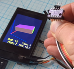

BMI160 IMU visualization on a moddable-two
==========================================

Little graphics demo using a moddable two.

Stuff used:

- moddable two (esp32)
- Bosch BMI160 accelerometer & gyroscope
- Xio Tech sensor fusion (https://github.com/xioTechnologies/Fusion)
- Poco outline drawing

Code architecture:

- worker runs at 100Hz to fetch IMU data
- at 16Hz worker pipes IMU data through sensor fusion algorithm and outputs position data (roll/pitch/yaw)
- main thread consumes position data, does 3D projection, and draws rendering of PCB

Short demo video: https://tve.s3.amazonaws.com/public/imu-demo-20230610-1300.mp4

Getting 16fps rendering is pretty darn amazing, Poco rocks!
